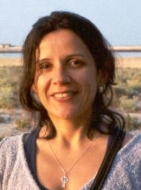

## Ontologies for NLP, NLP for ontologies

### Speaker

- [Renata Vieira](http://www.inf.pucrs.br/~rvieira/).

### Abstract

In this talk I will say a few words about the relation of ontologies
and natural language processing, considering this relation in two
directions. I will show some examples of how some natural language
applications use ontologies as a resource, and how we can build and
maintain ontologies with the help of natural language processing. All
this will be seen from a perspective of the Portuguese language, as it
has been an essencial part of my work.

### Short bio

<table> <tr> <td></td><td
style="padding: 5px;"> 
<a
href="http://www.inf.pucrs.br/~rvieira/">Renata Vieira</a> possui
título de PhD em Informática pela University of Edinburgh (1998). É
professora da PUC-RS onde atua em pesquisa e ensino na graduação e
pós-graduação na área de inteligência computacional, com ênfase em
processamento de linguagem natural, representação do conhecimento,
ontologias, agentes e web semântica. Possui experiência em coordenação
de projetos, é membro de comitês científicos das principais
conferências internacionais da área de lingüística computacional e
agentes inteligentes. Participa ativamente no desenvolvimento da área
de processamento de linguagem natural no país. Em 2007 atuou com
Pesquisador Visitante Sênior CAPES-Fulbright na Universidade do Texas
em Austin.
</td></tr></table>

